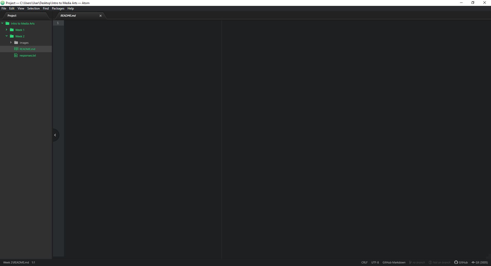

# Assignment-02
## Eric Brown

I would like to get more fluent in using atom, html, CSS and overall how to build
a functioning website. Also get more familiar with with CSS and how to use it
more efficiently.

This is a list of things in markdown:

1. Learning Atom.
2. Learning GitHub.
3. Learning how to link them both.

[You Tube](https://www.youtube.com/)

[My Responses File](./responses.txt)

